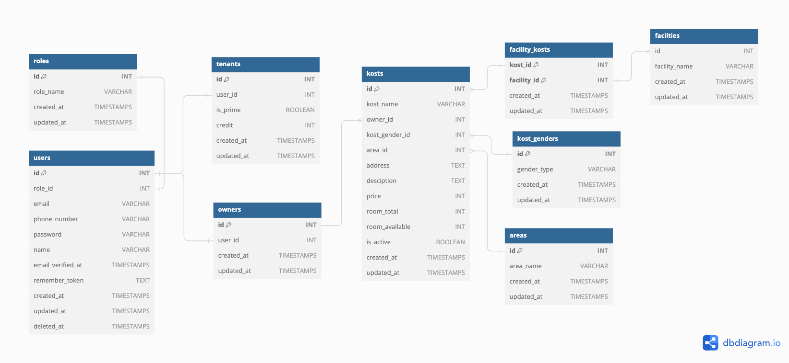

<p align="center"><a href="https://laravel.com" target="_blank"></a></p>

<p align="center">
<a href="https://github.com/laravel/framework/actions"></a>
<a href="https://packagist.org/packages/laravel/framework"></a>
<a href="https://packagist.org/packages/laravel/framework"></a>
<a href="https://packagist.org/packages/laravel/framework"></a>
</p>

# Kost Room Availability Apps

Welcome to the Kost Room Availability Booking Platform, a Laravel backend application designed to simplify the process of finding kost(boarding houses).

## Table of Contents

-   [Features](#features)
-   [Technologies Used](#technologies-used)
-   [Usage Instructions](#usage-instructions)
-   [Getting Started](#getting-started)
-   [APIs and Authentication](#apis-and-authentication)
-   [Postman Collection](#postman-collection)
-   [Database](#database-schema)

## Key Features

1. **User Credits:**

    - Regular tenant: 20 credits on registration.
    - Premium tenant: 40 initial credits.
    - Owners: No initial credits.

2. **Kost Management:**

    - Owners can list multiple kosts.

3. **Advanced Search:**

    - Users can search kosts by name, location, and price

4. **Credit Usage:**
    - Tenant lose 5 credits for room availability inquiries.

## Additional Features

-   **Authentication:**

    -   APIs for owners and room availability are secured.

-   **Credit Recharge:**

    -   Monthly automated credit recharge.

-   **Mail Verification:**
    -   User registration requires email OTP verification.

## Technologies Used

-   Laravel: Backend framework for robust and scalable web application development.
-   MySQL: Database management for storing user data, kost information, and credit transactions.
-   API Authentication: Securing Owner API & Room Availability API using laravel-sanctum.
-   Scheduled Commands: Utilizing Laravel's task scheduler for automated monthly credit recharge.
-   Queue: Utilizing Laravel's queue using redis to send otp into mail

## Usage Instructions

1. **User Registration:**

    - Sign up as a regular or premium user to avail initial credits.

2. **Kost Search:**

    - Explore kost listings by searching with criteria such as name, location, and price.

3. **Room Availability Inquiry:**

    - Inquire about room availability to find suitable kost options, with a deduction of 5 credits.

4. **Owner Operations:**

    - Owners can add and manage multiple kost listings using the Owner Dashboard.

5. **Scheduled Credit Recharge:**
    - User credits are automatically recharged at the beginning of each month.

### Prerequisites

-   [Docker](https://docs.docker.com/get-docker/)
-   [Docker Compose](https://docs.docker.com/compose/install/)
-   [Composer](https://getcomposer.org/)

## Getting Started

1. Clone this repository:

```bash
git clone https://github.com/destafajri/room-availability-backend-laravel
```

```bash
cd room-availability-backend-laravel
```

2. Build and start the Docker containers:

```bash
    docker-compose up --build
```

3. Install Laravel dependencies:

```bash
docker-compose exec laravel composer install
```

4. Run database migrations and seed:

```bash
    docker-compose exec laravel php artisan migrate --seed
```

5. Run queue woker:

```bash
    docker-compose exec laravel php artisan queue:work
```

6. Run the scheduller task:

```bash
    docker-compose exec app php artisan schedule:run
```

7. To Access this project you can use this [http://localhost:8000/](http://localhost:8000/) and for mailhog to receive the otp, you can visit this [http://localhost:8025/](http://localhost:8025/).

## APIs Specs

| Name                    | Method | URL                                      | Token Required |
| ----------------------- | ------ | ---------------------------------------- | -------------- |
| Register Owner          | POST   | {{base_url}}/api/register/owner          | No             |
| Register Tenant Prime   | POST   | {{base_url}}/api/register/tenant/prime   | No             |
| Register Tenant Regular | POST   | {{base_url}}/api/register/tenant/regular | No             |
| Verify otp              | POST   | {{base_url}}/api/otp/verify              | No             |
| Login                   | POST   | {{base_url}}/api/login                   | No             |
| Logout                  | POST   | {{base_url}}/api/logout                  | Yes            |
| Create Kost By Owner    | POST   | {{base_url}}/api/owner/kost              | Yes            |
| Update Kost By Owner    | PUT    | {{base_url}}/api/owner/kost/:id          | Yes            |
| Delete Kost By Owner    | DELETE | {{base_url}}/api/owner/kost/:id          | Yes            |
| List Kost By Owner      | GET    | {{base_url}}/api/owner/kost?per_page=1   | Yes            |
| List Kost               | GET    | {{base_url}}/api/kost?per_page=10        | Yes            |
| Detail Kost             | GET    | {{base_url}}/api/kost/:id                | No             |
| Ask Room                | POST   | {{base_url}}/api/ko                      |

## Postman Collection
[](https://www.postman.com/gold-station-218460/workspace/room-availability-apps-laravel/collection/22138766-e2420475-a461-47e5-ab4f-0095ca9f6fac?action=share&creator=22138766)

## Database Schema


## Contributors

[](https://github.com/destafajri/room-availability-backend-laravel/graphs/contributors)

